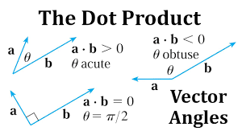

### _MY CODE_ 
## _NAKSHATRA BANSAL_
#**Vector Dot Product Implementation**

## **Introduction**
The definition of dot product can be given in two ways, i.e. algebraically and geometrically. Algebraically, the dot product is defined as the sum of the products of the corresponding entries of the two sequences of numbers.
- a.b=|a||b| cosθ

---

## **Mathematical Expression**  
The dot product of two vectors _A_  and _B_, each of size $\ n \$, is calculated as:
$$\[
\mathbf{A} \cdot \mathbf{B} = \sum_{i=1}^{n} A_i B_i = A_1 B_1 + A_2 B_2 + \cdots + A_n B_n
\]$$

---

## **Code Example**  
Below is a snippet of the implementation in Python:  

Here is a list of all what has been included in this readme file:
- [x] Headings
- [x] Styling
- [x] Quoting text
- [x] Links
- [x] Images
- [x] Lists (along with task lists)
- [x] Footnotes
- [x] Alerts
- [x] Tables
- [x] Code
- [x] Mathematical Expressions


```python
def dot_product(vector_a, vector_b):
    if len(vector_a) != len(vector_b):
        raise ValueError("Vectors must be of the same length")
    return sum(a * b for a, b in zip(vector_a, vector_b))

# Example usage
vec_a = [1, 2, 3]
vec_b = [4, 5, 6]
result = dot_product(vec_a, vec_b)
print("Dot product:", result)
```
---
## Here is a diagram elaborating the mathematical equation graphically.[^1]

[^2}

[^1]: This image has been taken from `cuemath.com`.
[^2]: Dot product image.

GIT COMMIT
    -git add "filename" 
    -git commit -m "commit"
        - DONE COMMIT IN TERMINAL.

> [!TIP]
> Sometimes such critical information may lead to end of the world, so use it responsively.

> [!NOTE]
> Useful information that users should know, even when skimming content.


| version of algorithm       | time complexity          | space complexity  |
| ------------- |:-------------:| -----:|
| version 1      | O($n^2$) | O($n^2$) |
| version 2     | O($n^2$)     |  O(nlogn) |
| version 3 | O(nlogn)      |    O($n^2$) |


Search at youtube [youtubewebsite](https://www.youtube.com/)
:tada: ALL DONE 
